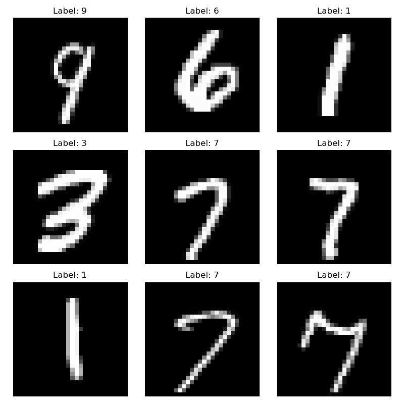
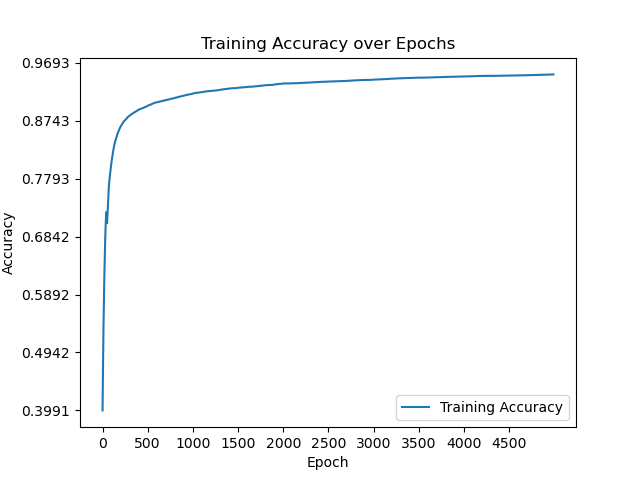
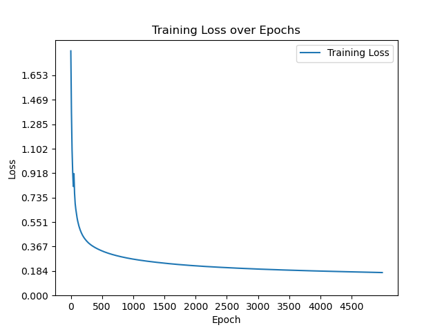
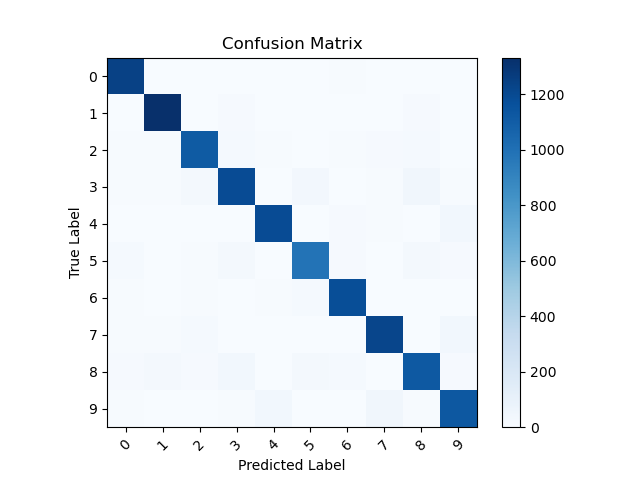

# 从零开始---徒手搭建神经网络

## 👋 介绍

不用 PyTorch 与 TensorFlow，徒手搭建神经网络，深入理解基本原理。

写了三个语言版本，分别是 Python、Java、C++。

进入相应文件夹运行各自的 `HandwrittenDigitRecognition(.py/java/cpp)` 文件即可查看运行结果。

手写数字识别的准确率可以轻松达到`90%+`。

此项目中的 `data.csv` 数据，来自 MNIST 数据集手写数字识别。
  

    

<!-- /output_picture/sample_images.png) -->

  

### C++：
- 真正的从零开始，从编写矩阵相加、相减、转置、相乘、相加广播机制、交叉熵函数等各种基础函数算法，到神经网络的前向传播、反向传播、梯度下降，搭建起一个神经网络。

### Java：
- 与 C++ 一样，从零开始。

### Python：
- 只用 NumPy 搭建，最后用 Matplotlib 画图，图片在 `python(numpy)/output_picture` 中。

- 因为梯度下降计算过程中，反向传播算法的计算运用到偏微分求导，链式法则，环环相扣，其中一环涉及到 `w@x+b=z`，已知 `dz` 那么如何求 `dw`，参见 `python(numpy)/dW矩阵求导`。

- Python(numpy)文件夹中还有一个更加简单的神经网络 `numpy---最简单的神经网络.py`。

- 展示一下`python(numpy)/output_picture`里的图片：
  

    
    
    

<!-- /output_picture/accuracy.png)
/output_picture/loss.png)

/output_picture/confusion_matrix.png) -->